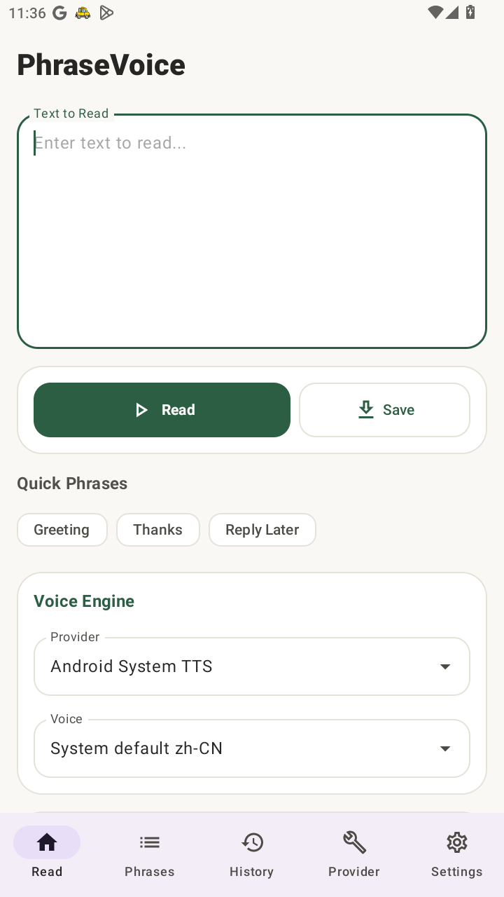
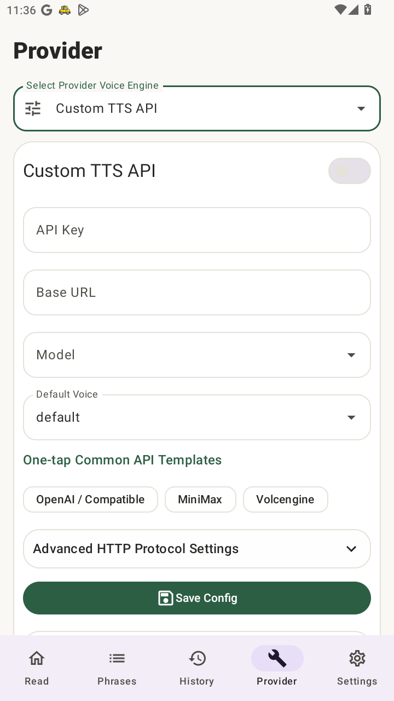
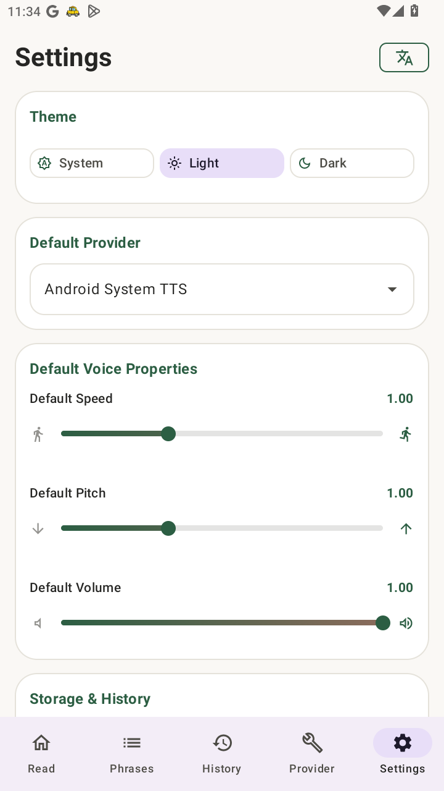

# PhraseVoice

[](https://github.com/lilynas/PhraseVoice/actions/workflows/android.yml)


**Language**: [简体中文](README.md) | English

PhraseVoice is a lightweight Android text-to-speech app for quickly reading text aloud, managing reusable phrases, and generating audio through multiple voice providers.

## Screenshots

<p>
  
  
  
</p>

## Features

- Read text aloud, stop playback, save audio, and share generated audio
- Phrase library: add, edit, favorite, search, import, and export JSON
- History: replay past text and save items as reusable phrases
- Multiple providers: Android System TTS, OpenAI TTS, Edge TTS Forwarder, Gemini TTS, MiMo TTS, and Custom HTTP
- MiMo VoiceDesign character voices, prompt optimization, and streaming synthesis
- Light/dark themes, in-app language switching, and optional debug logs

## Tech Stack

- Kotlin
- Jetpack Compose + Material 3
- Android DataStore
- Kotlin Coroutines
- OkHttp
- Media3 ExoPlayer
- GitHub Actions CI

## Download

Download the latest APK from [Releases](https://github.com/lilynas/PhraseVoice/releases).

## Build

The project is built through GitHub Actions. CI uses JDK 17, Android SDK 35, and Gradle 8.7:

```bash
gradle :app:assembleDebug :app:assembleDebugAndroidTest :app:testDebugUnitTest --stacktrace
```

## License

Apache License 2.0. See [LICENSE](LICENSE).
