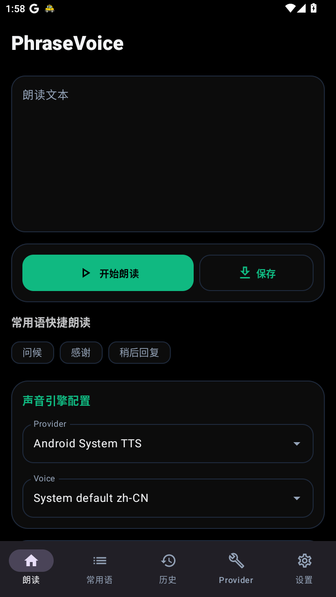
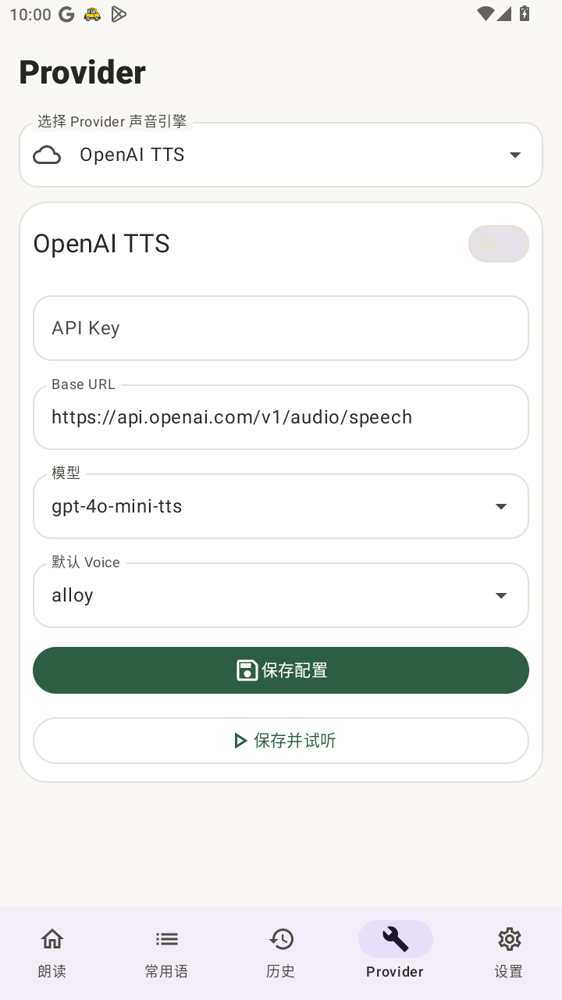
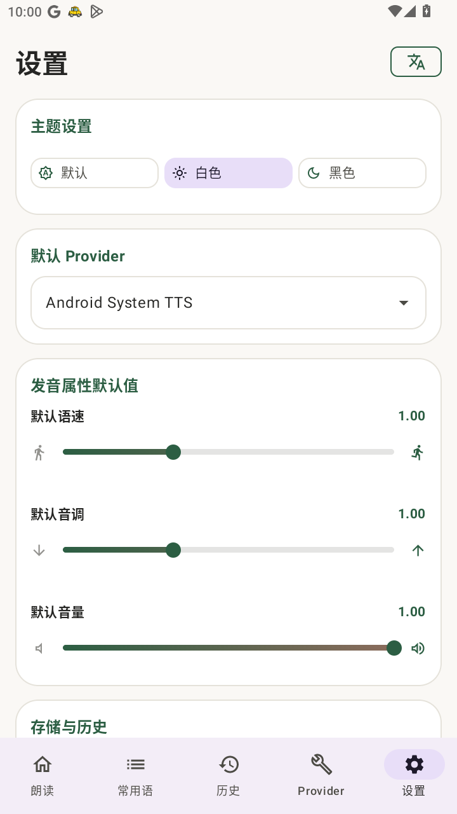

# PhraseVoice

[](https://github.com/lilynas/PhraseVoice/actions/workflows/android.yml)


**语言**：简体中文 | [English](README.en.md)

PhraseVoice 是一个简洁的 Android 文本转语音工具，适合快速输入文本、管理常用语，并通过不同语音服务生成朗读音频。

## 截图

<p>
  
  
  
</p>

## 功能

- 文本朗读、停止、保存与分享音频
- 常用语管理：新增、编辑、收藏、搜索、导入和导出 JSON
- 历史记录：重播、保存为常用语
- 多 Provider：Android System TTS、OpenAI TTS、Edge TTS Forwarder、Gemini TTS、MiMo TTS、Custom HTTP
- MiMo VoiceDesign 角色声音、提示词优化与流式合成
- 深色/浅色主题、应用内语言切换、调试日志开关

## 技术栈

- Kotlin
- Jetpack Compose + Material 3
- Android DataStore
- Kotlin Coroutines
- OkHttp
- Media3 ExoPlayer
- GitHub Actions CI

## 下载

请在 [Releases](https://github.com/lilynas/PhraseVoice/releases) 下载最新 APK。

## 构建

项目通过 GitHub Actions 编译。CI 使用 JDK 17、Android SDK 35 和 Gradle 8.7 执行：

```bash
gradle :app:assembleDebug :app:assembleDebugAndroidTest :app:testDebugUnitTest --stacktrace
```

## License

Apache License 2.0. See [LICENSE](LICENSE).
